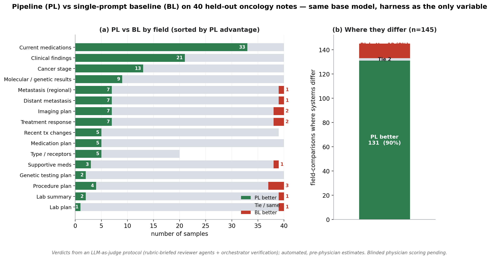

# MONTEFIORE EINSTEIN COMPREHENSIVE CANCER CENTER (MECCC)
## Request for Pilot Project Progress, Impact, and Outcomes

## Abstract

Direct generation of patient information by large language models (LLMs) can produce inaccurate, incomplete, or oversimplified information. This project was originally designed to generate clearer explanations of oncology terminology and clinic information; however, early physician review of patient-letter outputs highlighted the need for stronger safeguards. We therefore refocused this phase on faithful extraction of structured clinical information from oncology clinic notes as a prerequisite for safe patient education. We developed an on-premises inference harness around a frozen, locally served open-weight LLM, without fine-tuning. The system uses multi-stage extraction, oncology-specific drug and terminology dictionaries, a separate verification cascade, and deterministic clinical post-processing rules to extract key fields such as active anticancer therapy, disease stage, metastatic status, and treatment response. A preliminary 40-note, LLM-assisted comparison favored the harness in 131 of 618 field comparisons, favored the baseline in 12, and tied the remainder. A subsequent prompt audit found that the legacy baseline did not fully match the evaluated field contract, so these estimates require confirmation with the corrected matched baseline. In the archived results, the harness had a positive net advantage in every predefined core field category, although the baseline still won individual response and metastasis comparisons. Blinded physician scoring remains the confirmatory evaluation.

## Accomplishments (1 page)

**Model development.** We developed a complete and reproducible oncology information-extraction pipeline ("PL") using a frozen, locally hosted open-weight language model (Qwen2.5-32B-Instruct-AWQ via vLLM), without any model weight training by design. This approach keeps data local, does not require a labeled training set, and improves reproducibility. The pipeline includes: **(i) multi-stage extraction** — eight field-specific prompts organized in two stages (six independent prompts, then two dependency-aware prompts that take the first stage's output as context), plus a dedicated care-plan extraction stage; **(ii) a separate five-gate, per-field verification cascade** applied to each extracted field after extraction, evaluating format, schema validity, specificity/semantic alignment, faithfulness to the source note, and temporal relevance; **(iii) two deterministic resources**, including 136 loaded oncology-drug entries and 9,331 loaded medical-dictionary entries; and **(iv) approximately 135 deterministic clinical post-processing rules**, each triggered only when its specific clinical condition is met.

**Development and physician-preference loop.** Pipeline development drew from a 200-note unannotated pool; the documented iterations covered 56 breast notes and all 100 pancreatic notes (approximately 15 breast and 18 pancreatic development rounds), prioritizing generalizable clinical rules over test-set-specific hard-coding. The loop differed by cancer type: for breast cancer, an oncologist reviewed outputs and that feedback was relayed into the same working session and provided to the LLM judge as context, so the judge captured the physician's preferences; for pancreatic cancer, iteration was then driven by that preference-informed LLM judge alone, with no physician input, and still produced PL > BL — indicating the captured preferences transferred.

**Evaluation method and important caveat.** Current performance estimates are based on an LLM-assisted review protocol, with blinded physician review currently underway. In this protocol, the 40 samples were split across several independent LLM reviewer agents working in parallel (each reviewing a subset of the samples). Each agent was given the clinical rubric — the four evaluation principles, error-severity levels, and field-specific criteria — then read the full source note and both system outputs and judged each field in natural language based on clinical accuracy and source-note fidelity, rather than keyword matching. A separate model then rechecked every PL loss and contested judgement against the source note. This LLM-as-judge approach is consistent with emerging healthcare evaluation methods, including a scoping review of LLM-as-a-judge methods and human alignment in healthcare [1], as well as a clinical-summary study validating LLM judges against a human instrument, the Provider Documentation Summarization Quality Instrument (PDSQI), with strong inter-rater reliability [2]. A blinded physician scoring study has already been sent out and will serve as the confirmatory evaluation.

**Impact (cancer relevant).** These results suggest that a locally deployed LLM, which performs poorly when used with a naïve single-prompt approach, can become substantially more clinically reliable when placed inside a structured inference harness. This finding is directly relevant to oncology deployment, as keeping the model local supports HIPAA-compliant workflows, and model fine-tuning may be impractical because of resource limits such as scarce labeled data, hospital infrastructure constraints, or reproducibility concerns. Importantly, the improvements are concentrated in oncology-specific, clinically meaningful fields, including correctly separating active anticancer regimens from general home medications, identifying cancer stage, and distinguishing regional nodal involvement from distant metastatic disease. Faithful extraction of these data elements provides a necessary foundation for safe patient communication and supports downstream cohort identification, insurance prior authorization, registry development, and clinical research workflows.

**Key Outcomes.** In a preliminary comparison of 40 oncology notes, PL outperformed the legacy single-prompt BL in 131 of 618 field comparisons, tied in 475, and underperformed in 12 under LLM-assisted review. A later prompt audit found that the legacy BL did not fully match the evaluated contract, so a matched-baseline rerun is required before these estimates are used as final ablation evidence. In the archived run, PL had a positive net advantage within every predefined core field category, but BL did win individual response and metastasis comparisons. The largest separation was current anticancer therapy identification (33 PL wins and 0 losses), which especially requires confirmation under the corrected contract.

**Grants or publications resulting from project.** No publications have resulted yet; manuscript preparation is planned after completion of blinded clinician scoring.

## Goals for the next reporting period

- Complete the blinded clinician scoring study that is currently in progress. The A/B-blinded scoring instrument (system identity hidden) has already been sent to oncologist reviewers; we will collect and analyze their independent, quantitative PL-versus-BL ratings and compare them against the LLM-assisted estimates reported here.
- Work on manuscript writing and submission.

## No Cost Extension?

No. Remaining project activities and pending/planned expenditures are expected to be completed within the current project period.

## Unobligated Balance?

Total pending or planned expenditures: $3,970.25, including $470.25 in incurred cloud-computing costs pending reimbursement, $1,500 in participant incentives for attending/fellow physician reviewers, and $2,000 in publication-related costs.

## Figure

**Figure 1. Preliminary Pipeline (PL) vs legacy single-prompt baseline (BL) results on 40 held-out oncology notes.** The archived values are LLM-assisted, pre-physician estimates. Because a later audit found that the BL prompt was not fully contract-matched, this figure must be regenerated after the corrected matched-baseline rerun. The current defensible summary is category-level: PL had a positive net advantage in each predefined core field category, while BL still had individual wins in response and metastasis fields.

## References

1. Li L, Li D, Chen C, et al. *LLM-as-a-Judge in Healthcare: A Scoping Analysis of Applications, Methods, and Human Alignment.* arXiv:2605.25273 (2026).
2. Croxford E, Gao Y, First E, et al. *Evaluating clinical AI summaries with large language models as judges.* npj Digit. Med. 8, 640 (2025). doi:10.1038/s41746-025-02005-2.
