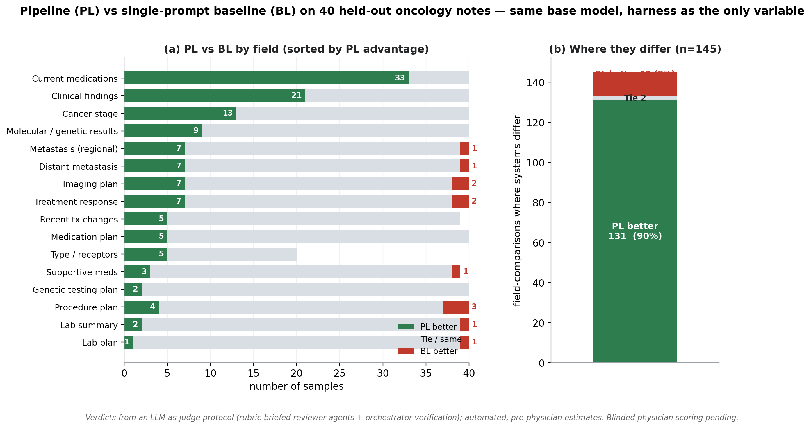

# 进展报告 — 用本地 LLM 从肿瘤科笔记做忠实的结构化提取

## 摘要（Abstract）

我们在构建一个系统，把自由文本的肿瘤科门诊笔记转成忠实的结构化临床字段（现用抗癌药、分期、转移、疗效、受体/分子状态、各类诊疗计划），以便在不产生幻觉、不泄露隐私的前提下向患者做总结。我们的方法不做微调，而是**围绕一个冻结的、本地部署的开源模型构建推理编排层（inference harness）**（Qwen2.5-32B-Instruct-AWQ，经 vLLM 部署）：多阶段提取、独立的五道验证 gate 级联、肿瘤药物/术语词典、约 135 条确定性临床后处理规则——全部在本地运行、符合 HIPAA 关切。在 40 条专家标注的 held-out 笔记（20 乳腺 + 20 胰腺）上，我们做了一个受控消融实验：固定底座模型与字段 schema，使 harness 成为唯一变量。在一套**明确规程的 LLM 辅助逐字段审查**下（这些是自动化的、医生评审前的初步估计），618 个字段对比中 harness（PL）相对同模型单 prompt（BL）**胜 131、负 12**，其余打平；在两个系统给出不同答案的字段里，**PL 占 90%**，且在核心诊断字段上从不落败。**医生盲评研究是确认性的下一步，且已经递交出去**等结果。此前医生对患者信件版本的评审指出其过度简化，这促使我们在本期把重心移到可客观度量的提取任务上。

## 工作成果（本报告期 Accomplishments）

**已建成的方法。** 一条完整、可复现的提取流水线（"PL"），运行在冻结的开源模型之上，**按设计不做权重训练**（数据留本地、无需标注语料、可复现）。本系统是一个*推理编排层（inference harness）*——固定底座模型 + 确定性的路由与规则。所有适配都在推理期完成，分四层：

- **(i) 多阶段提取** —— 笔记是分阶段读的，而非一个 prompt。*阶段 1*：6 个独立 prompt（就诊原因；含分型/分期/转移的诊断；检验；查体与影像发现；现用药；治疗变化）。*阶段 2*：2 个依赖阶段 1、并把其输出作为上下文的 prompt（治疗目标；疗效）。*阶段 3*：计划提取（用药 / 手术 / 影像 / 检验 / 基因检测 / 转诊 / 随访）。
- **(ii) 五道验证 gate 级联** —— 是在提取**之后**对每个已抽字段施加的一个*独立*层（不属于上面的提取阶段）：格式修复 → schema/key 校验 → 具体化与语义对齐 → 忠实度修剪 → 时态过滤。
- **(iii) 两部确定性词典** —— 约 148 种肿瘤药；18,739 条医学术语（8 年级阅读水平）。
- **(iv) 约 135 条确定性后处理规则**，每条仅在其临床触发条件满足时才生效（如区域 vs 远处淋巴结、把"暂停化疗"算作一种计划变更、受体一致性）。

**开发与"医生偏好"循环。** 开发采用在 200 条未标注笔记上的评估驱动循环（乳腺约 15 轮、胰腺约 18 轮），优先写可泛化的临床规则而非针对测试集硬编码。该循环按癌种不同：**乳腺**由一名肿瘤科医生评审输出，其反馈被转述进同一个工作 session、作为上下文交给 LLM judge，使 judge 捕获了医生的偏好；**胰腺**则仅由这个"带偏好"的 LLM judge 单独迭代、**无任何医生输入**，结果仍是 PL > BL——说明所捕获的偏好迁移了过去。

**评估方法（重要说明）。** 当前所有判定来自 **LLM-as-judge 规程，而非人工审查**：40 个样本分给若干个 LLM 审查 agent 并行评审（每个 agent 审一部分样本）。每个 agent 都被 brief 了临床 rubric（4 原则、P0/P1/P2 分级、逐字段定义、"抽取而非总结"），逐条阅读**完整**原文笔记 + 两系统输出，用自然语言判定（不用脚本/关键词匹配）；之后由一个独立的编排模型对每个 PL 落败和有争议的判定回原文复核。这套 LLM-as-judge 设计遵循医疗领域已有的规程——一篇关于医疗 LLM-as-a-Judge 方法与人类对齐的 scoping 综述 [1]，以及一项把 LLM 裁判对照人类量表（PDSQI）验证、显示强评分者间一致性的临床总结研究 [2]——两者都报告 LLM 与专家判断有中到强的一致性。因此这些数字是**自动化的、医生评审前的初步估计**；已递交出去的医生盲评研究才是用来确认它们的。

**关键结果（Key outcomes）。**
- **受控消融（40 条 held-out），PL vs 单 prompt baseline（BL），同底座+同 schema；LLM 辅助审查：** 618 个字段对比中 PL 更好 **131** / 打平 **475** / BL 更好 **12**；在两系统给出不同答案的字段里，**PL 占 90%**，且在**核心诊断字段上从不落败**（图 1）。我们把**核心诊断字段**定义为需要肿瘤学知识才能答对的高价值字段：现用抗癌药、分期、远处转移、区域转移、疗效、分型/受体状态、分子/遗传结果。区分最强的单项是现用药"抗癌药 vs 非癌家用药"识别（**33 胜 : 0 负**）；分期、远处转移、分子/遗传结果同样 PL 占优。
- **部署安全性（同底座，裸 prompt vs harness，40 封信）：** 裸 prompt 下模型 **0/40 可发送**（45% 泄露去标识占位符，12.5% 幻觉）；放进 harness 后同一模型达到**零幻觉、零去标识泄露、全本地**——即让该开源模型在真实笔记上可安全使用的是 harness，而非更大的模型。
- **held-out 提取准确性（乳腺）：** P0（幻觉）= 0，P1 = 0；受体状态 93%，治疗目标方向 100%。

**影响（Impact）。** 该结果说明：一个冻结的、开源的、**本地部署的**模型——直接裸用于该任务时不可用——仅通过推理 harness 就能变得临床可靠。这对临床部署直接相关：数据不能离开机构、模型微调往往不可行；同一套做法无需重训即可迁移到其他笔记类型。

**与癌症相关的影响（Cancer-relevant impact）。** harness 修好的每一个高价值字段都是肿瘤特异且与决策相关的：正确区分在用抗癌方案与家用药、判定 AJCC 分期、区分区域淋巴结受累与远处转移、抽取分子结果（如 BRCA、MMR/MSI、CA19-9 non-secretor）。对这些字段的准确忠实提取，是安全的患者沟通以及乳腺癌/胰腺癌下游队列/登记用途的前提。

## 下一报告期目标（Goals for the next reporting period）

1. **医生盲评（进行中，已递交）：** A/B 盲评工具（隐藏系统身份）已交给肿瘤科医生；收集并分析其独立的量化 PL-vs-BL 胜率，与本报告中 LLM 辅助的估计相互印证。
2. **泛化审计：** 确认约 135 条后处理规则编码的是通用临床逻辑（非测试集 artifact），并在新笔记 / 更多癌种上验证。
3. **确定性：** 降低 greedy 解码的跨运行波动，使最终指标稳定。
4. **准确性优先的总结：** 在明确"准确性优于简化"的约束下重新引入面向患者的输出。
5. **撰写论文：** 把消融 + 部署结果整合成一篇可发表的"用于冻结本地 LLM 上可靠提取的推理 harness"报告。

## 图（Figure）

**图 1. 在 40 条 held-out 肿瘤科笔记上，pipeline（PL）vs 单 prompt baseline（BL）；底座模型与字段 schema 完全相同，故 harness 是唯一变量。** **(a)** 逐字段结果（判为 PL 更好 / 打平 / BL 更好的样本数），按 PL 优势排序；标注了 PL 胜场（左）与 BL 胜场（右）。PL 在每个临床深度字段上领先，其中现用药分类最为突出（33:0）。**(b)** 只看两系统真正给出不同答案的字段对比（n = 145），PL 在 90% 的情况下更好，打平 2、BL 更好 12；这 12 个 BL "胜"全部是次要计划/摘要字段的非幻觉性遗漏，无任何核心诊断落败。判定来自 **LLM-as-judge 规程**（被 brief 了 rubric 的审查 agent 逐条自然语言阅读完整原文，外加编排模型复核），即自动化的、医生评审前的估计；已递交一项医生盲评研究来确认。

## 讨论（Discussion）

多数字段打平，是因为两个系统共用同一个强底座模型；harness 可测量的价值恰好集中在那些"裸 prompt 系统性出错"的高知识字段——也正是医生关心的字段。少数 BL "胜"是轻微遗漏而非正确性错误，且本期通过一条让模型"抽取具体事实而非推断工整总结"的 prompt 改动进一步减少。首要注意点是：以上数字是 **LLM-as-judge，而非医生确认**；我们以 rubric 约束的规程加编排模型复核来缓解，但真正能验证它们的是现已送审的医生盲评研究。其次的局限是 greedy 解码带来的跨运行非确定性，会产生长尾波动，我们现以确定性规则加以控制。从患者信件转向提取这一方向调整，由医生反馈和"需要一个客观、受控的指标"共同驱动；既然提取已被证明可靠，受准确性约束的总结生成便是顺理成章的下一步。

## 参考文献（References）

1. Li L, Li D, Chen C, et al. *LLM-as-a-Judge in Healthcare: A Scoping Analysis of Applications, Methods, and Human Alignment.* arXiv:2605.25273 (2026).
2. Croxford E, Gao Y, First E, et al. *Evaluating clinical AI summaries with large language models as judges.* npj Digit. Med. 8, 640 (2025). doi:10.1038/s41746-025-02005-2.
